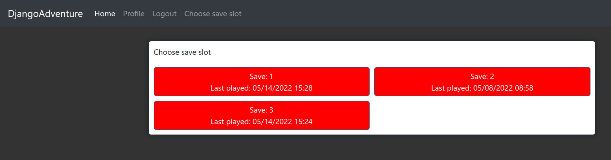

# Text-Adventure-Game

##  About
Text adventure game made with django and javascript. It allows registered users to choose one of 3 save slots and play simple game. Nothing too complicated.
<p align="center">

<br/>
Screenshot of menu
<br/>
<br/>

<br/>
Screenshot of actual game
</p>


## How to run
```
git clone https://github.com/Kacper-Cyganik/Text-Adventure-Game.git
```
```
pip install -r requirements.txt
```
### Make migrations and run server
```
python3 manage.py makemigrations
python3 manage.py migrate
```
```
python3 manage.py runserver
```
